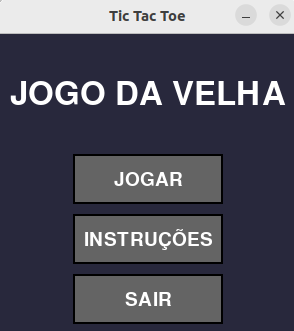
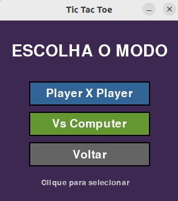
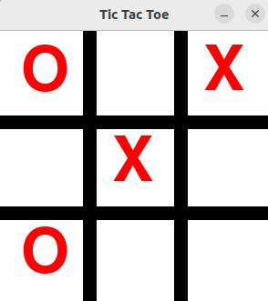
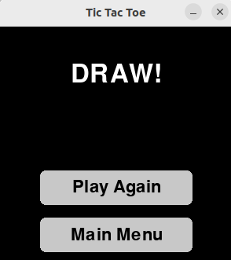

# pygame - tic_tac_toe

A tic-tac-toe game developed in **Python** using the **Pygame** library.  
The project was created with the aim of practicing concepts of **programming logic**, **graphics event handling**, and **interactive element design** with Pygame.

---

##  Features

- Graphical interface made 100% with **Pygame**.
- Games for **two local players**.
- Games **against the CPU**.
- CPU moves using the **Minimax algorithm**.
- **Visual indication** of victory and tie.

---

## Controls

- Click on an empty cell to mark your move.
- The game automatically alternates between X and O.

## Screenshots

Check out the game in action:
|  |  |
|-------------------------------|-------------------------------|
|  |  |


## How to execute

Clone the repository:

```bash
git clone https://github.com/gabrielrcastro/pygame-tic_tac_toe.git
```

```bash
cd pygame-tic_tac_toe
```
Run the game:

```bash
python3 main.py
```


